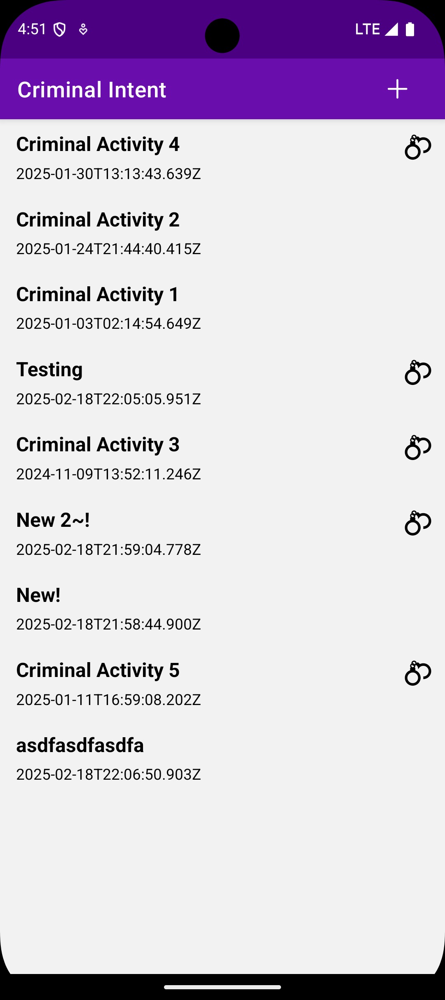
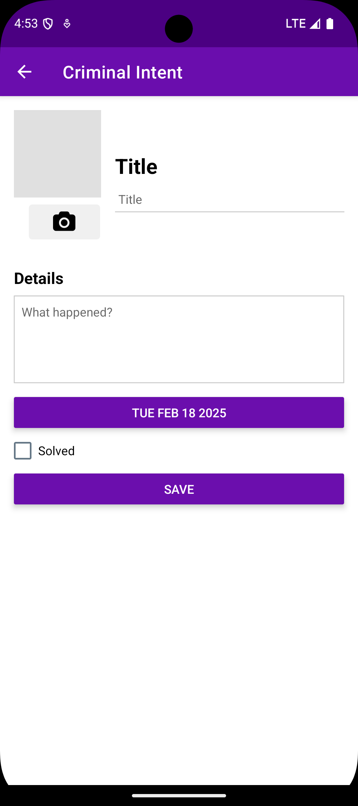
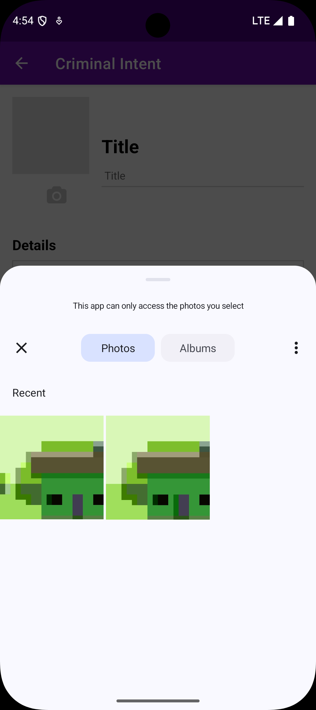
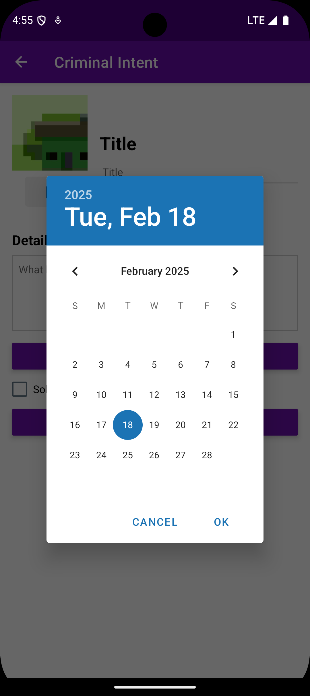
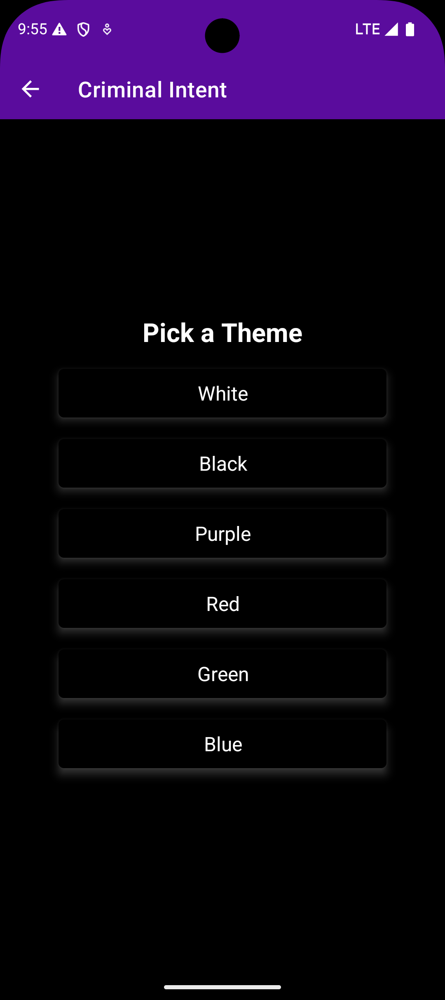
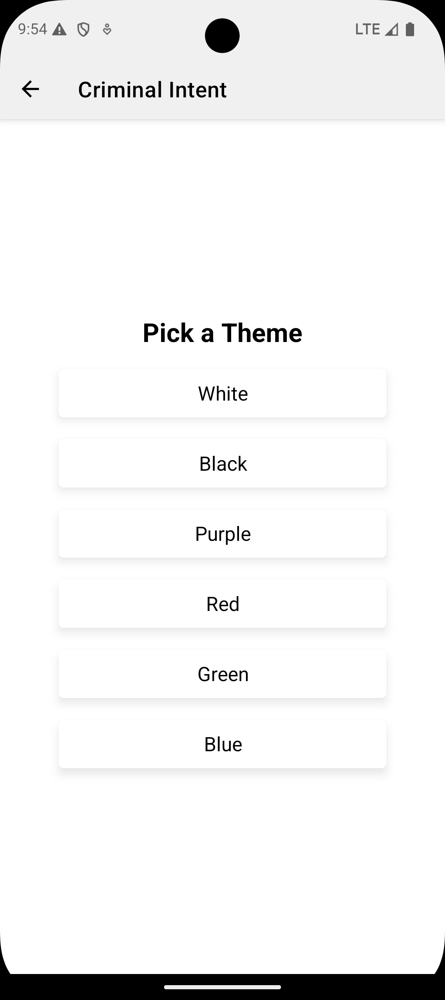

# CriminalIntentTemplate

For this assignment you will create a react native app with expo. You will complete the following requirements:

## Include Three Screens

### Index (Criminal Intent List)

The index screen will include a list of criminal activities.

You must use a flatlist on this page

The header should include a + button that will go to the detail page for a new crime. This + button should not show up on any other screen.

Pressing on any item should open the detail page with the data for that item.

Any item that is solved should show a handcuff icon on the right side.

### Crime Detail

The detail page should include a title, details, date button, solved checkbox, and a camera button.

The camera button should select a photo from the reel to add to this crime. After selecting a photo from the reel, returning to the detail page should show the photo on the top left.

There should be a save button that when pressed, stores the data onto the device. The data should not save any other way.

After pressing the save button display something to the user that shows the save completed successfully.

Pressing the button with the date shold open a new date picker modal.

After saving, when the back button is pressed, the index screen
should show an updated crime list with the new crime included.

### Settings

Add a settings cog to the header bar. This should show up on
every screen except for the settings page. This should link to
a new settings page.

The settings page should include 5-6 different themes. About half
of these should be light themed and half should be dark themed.

When these buttons are pressed they should update a React Context
and each page should reflect the theme appropriately.

## Other details

All data for crimes in the app needs to be stored locally on
the device using one of the expo data storage methods.

Crime data should not be passed around via context, but instead a
uuid should be passed from the index to the detail page and the id
should be used to get that data from local storage.

Settings data should be passed around via context.

## Submit your Code.

To submit your code, push your changes to github and submit a link to your repo in canvas.
